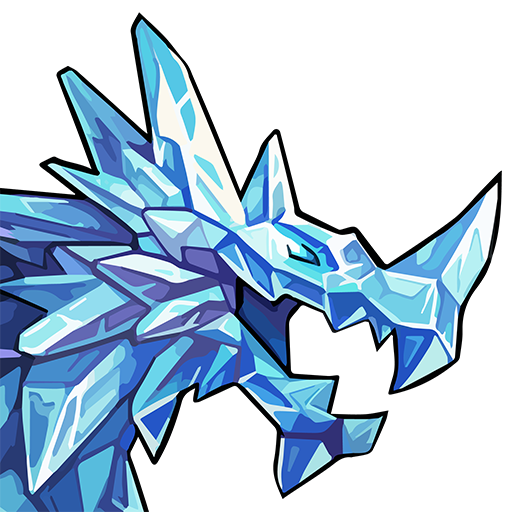

Krystara.io was a server project attempting to provide a comprehensive resource for Gems of War players. The frontend was built in React, and the backend used various different technologies such as Node.js Serverless over the course of the project's development.

Krystara.io sought to provide live data for Gems of War, including a live leaderboard and a comprehensive troop database. It also provided a suite of tools for Gems of War players, including a custom troop creator art tool.

Krystara.io was in sporatic development, and never launched, mainly due to technical issues with backend development. It was developed between February 2020 and September 2021. 
