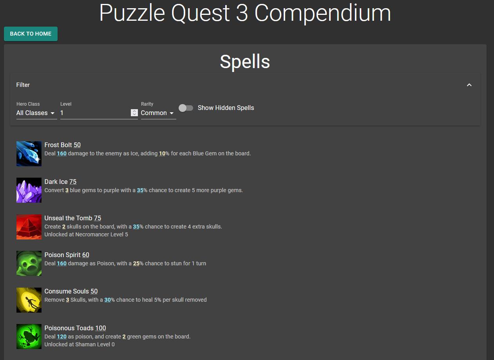

The PQ3 Compendium is a web app built in React. It cleanly displays game data about all the available spells from Puzzle Quest 3.

It has since become outdated, as the game has been drastically changed several times since its release during the game's open beta.

# [Check it out](https://pq3-compendium.vercel.app)
