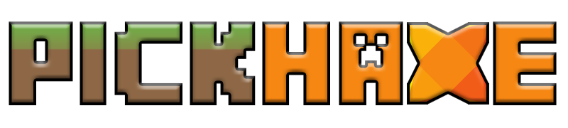

PickHaxe is a work-in-progress framework to allow developers to write Minecraft mods for Forge and Fabric using Haxe.

PickHaxe's goal is to provide, among other things, a full API of externs for Minecraft's classes as well as the automated tooling required to compile mods for the desired target mod loader and even the desired version.

# [Check it out](https://github.com/EliteMasterEric/PickHaxe)
