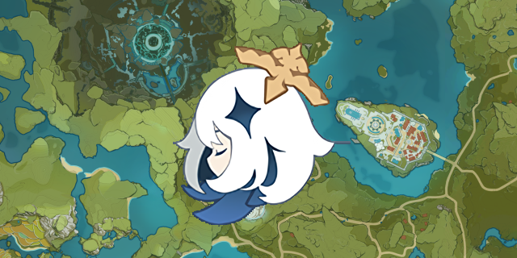

Teyvat.moe was a Genshin Impact interactive map site built in React. It featured robust data handling, a mobile-compatible map interface, localization, and advanced features to encourage community contribution.

This project was a learning experience, written to teach myself React, Serverless, and later Typescript over the course of several months.

Teyvat.moe was retired on August 1, 2021, due to lack of community contribution, and the release of HoyoLab's official Genshin Impact map service.
